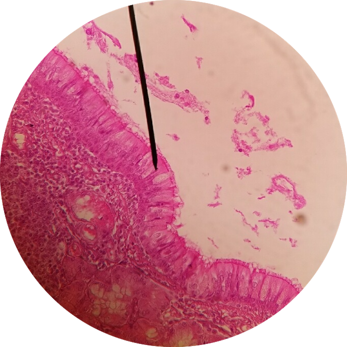

# Lab 1: Epithelial Tissue

 

### Lab Notebook Questions

##### Histological Technique

1.  Histological Technique (list the major steps with slight detail)
2.  Make a table including the different types of stains, and what they stain for
3.  Sketch the different stages of mitosis (with a description of each stage and what you can see histologically)
4.  Sketch the different planes of section

##### Epithelium

1.  Sketch out all the different types of epithelia, include location, function – make your list extensive. 
2.  Use your lab book, and textbook to to make your lab report as extensive as possible 

 
 
 
 
 
 
 
 

 
 
 
 
 
 
 
 

### Pathology

 
1.  TODO
 
 
 
 
 
 

 
 
 
 
 
 
 
 
 

 
 
 
 
 
 
 

