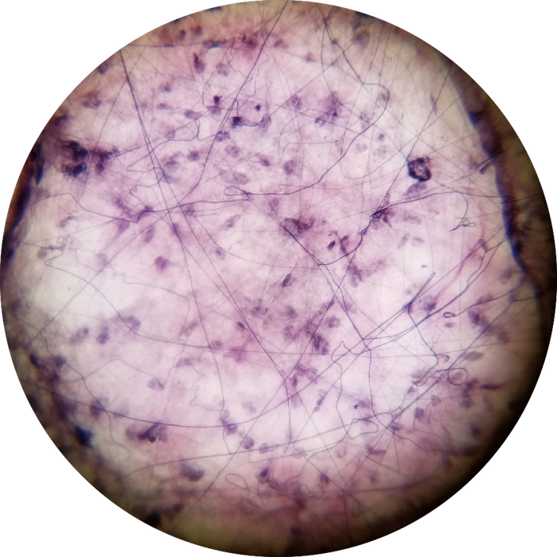

# Lab 2: Connective Tissue

 

### Lab Notebook Questions

1.  Sketch out all the different types of connective tissues, include location, function  
	*   Use your lab book, and textbook to to make your lab report as extensive as possible 
2.  Make a list of all the cells and what their functions are
    *   Fixed vs mobile cells (include a sketch also)
3.  Make a list of the types of fibers

### Practice Questions

  

    <strong>Question 1</strong>
  

  

    
What type of Connective Tissue is present in this view?

    
    

    <a class="btn btn-primary" role="button" data-toggle="collapse" href="#collapseExample01" aria-expanded="false" aria-controls="collapseExample"> Show Answer</a>
    

       
        

          Loose Areolar CT
        

    

  

 

  

    <strong>Question 2</strong>
  

  

    
What type(s) of fiber are present in the connective tissue from Question 1?

    

    <a class="btn btn-primary" role="button" data-toggle="collapse" href="#collapseExample02" aria-expanded="false" aria-controls="collapseExample"> Show Answer</a>
    

       
        

          Collagen fibers, Elastic fibers
        

    

  

 