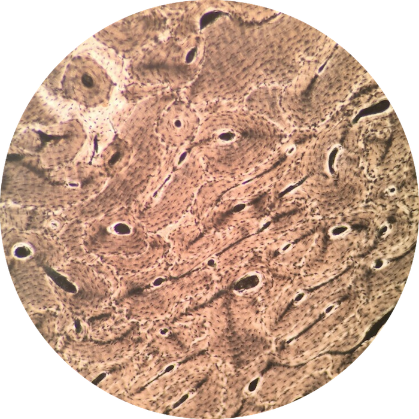

# Lab 3: Skeletal System

 

### Lab Notebook Questions

1.  Sketch the different cartilages – include: locations, presence of fibers, and functions
2.  Make a list of all the cells of the skeletal system and what their functions are
3.  List the steps of endochondral ossification
4.  List the steps of intramembranous ossification

### Practice Questions

  

    <strong>Question 1</strong>
  

  

    
What type of tissue is present in this view?

    
    

    <a class="btn btn-primary" role="button" data-toggle="collapse" href="#collapseExample01" aria-expanded="false" aria-controls="collapseExample"> Show Answer</a>
    

       
        

          Compact Bone
        

    

  
  

 

  

    <strong>Question 2</strong>
  

  

    
The tissue type of Question 1 is made up of the inorganic component of mostly a mineral called  __________________?

    

		<a class="btn btn-primary" role="button" data-toggle="collapse" href="#collapseExample02" aria-expanded="false" aria-controls="collapseExample"> Show Answer</a>
		

			 
	  		

		    	Hydroxyapatite  
		    	Ca10(PO4)6(OH)2
		  	

		

	

  

