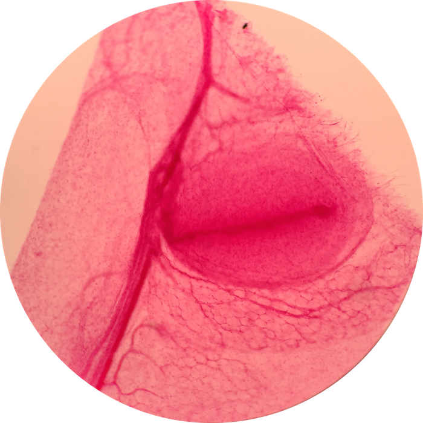

 
# Lab 5: Integumentary System

 

### Lab Notebook Questions

1.  Sketch the histological image of the nail, such as image B on page 144 
2.  ON an ENTIRE page sketch ALL the layers of the skin with the different tissue types, and different structures located in all layers (include hypodermis) much like the image on page 134 ( image 11-2)
    * Include all structures
    * All tissue types
    * All cells and their functions 
    * Glands and what they secrete
3.  Details about functions and structure of the cells

