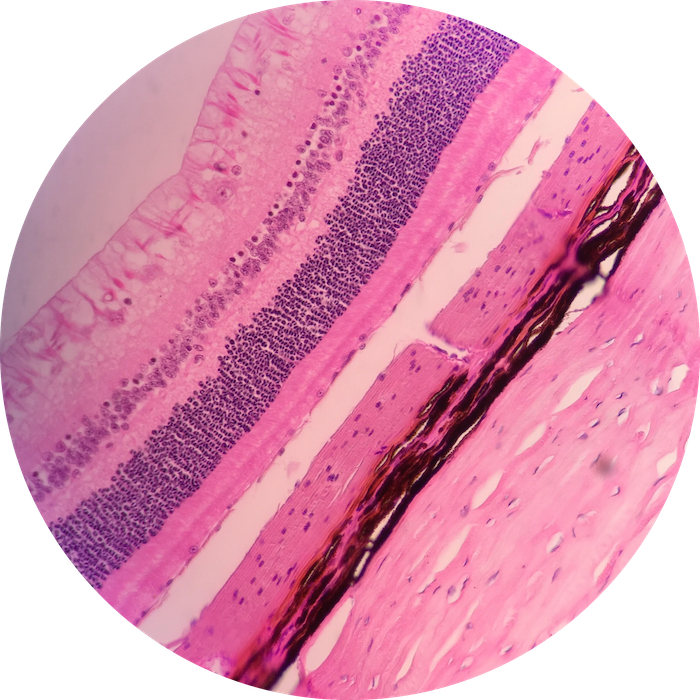

# Lab 7: Special Senses

 

### Lab Notebook Questions

1.  Sketch Olfactory Epithelium and label all the cells, and their functions
2.  Draw a pathway of neuronal input from the olfactory epithelium to the brain. (I drew this on the board) include cribiform plate, and include different areas of the brain involved
3.  Sketch a taste bud and label all the cells within-detail the functions
4.  Sketch they eye like figure 9-4 
5.  Sketch layers of the eye and KNOW THEM  (refer to figure 9-12)
	* _You didn’t have to for the practical 1, but you will for the quiz, practical 2, and final practical_
6.  Sketch a pathway of light going through the different structures of the eye and recall detraction of light! 
7.  Make sure to know all the structures of the eye, and for sure know: blind spot, Suspensory ligament, lens, iris, ciliary body, poster chamber, anterior chamber, Pigmented epithelium, Tarsal glands, optic nerve, 
8.  For the EAR: 
	* Sketch the pinna (refer to figure 9-15)
	* Internal Ear
	* Macula of Utricle and saccule
	* Ampulla of semicircular canal
	* Cochlea
	* Organ of corti

### Practice Questions

  

    <strong>Question 1</strong>
  

  

    
What is this multi-layered structure depicted in this view? What organ is this?

    
    

    <a class="btn btn-primary" role="button" data-toggle="collapse" href="#collapseExample01" aria-expanded="false" aria-controls="collapseExample"> Show Answer</a>
    

       
        

          Retina of the Eye
        

    

  
  

 

  

    <strong>Question 2</strong>
  

  

    
What type(s) of neurons are found in the photoreceptive layer of Question 1?

    

    <a class="btn btn-primary" role="button" data-toggle="collapse" href="#collapseExample02" aria-expanded="false" aria-controls="collapseExample"> Show Answer</a>
    

       
        

          Rods and Cones
        

    

  
  

 

