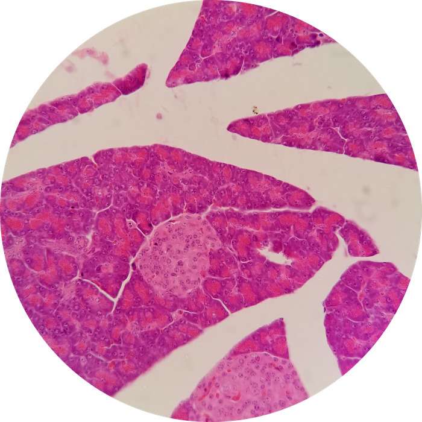
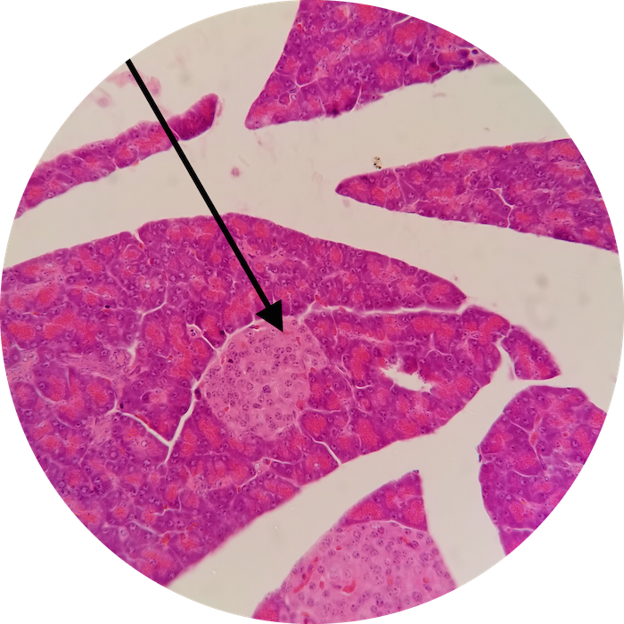

# Lab 8: Endocrinology

### Lab Notebook Questions

<!-- /////////////////////////////////////////// -->
<!-- [conditional logic for release of labnotes] -->

1.  Sketch all the glands
  * Label and identify any cells and make a table of their functions 
2.  List hormones and their functions (all of them) 
3.  What are neuroendocrine cells? 
4.  What are the embryological origins of the pituitary gland
5.  What is the paraventricular nucleus and the supraoptic nucleus
6.  Make a diagram of the RAS, as we have discussed so far… 
7.  Include descriptions of the clinical correlations from lecture book here
  * Summarized in _YOUR OWN WORDS!_

  <em>Available starting: 
    
_IF_SHOWING_ERROR_DATE_NOT_SET_CORRECTLY_VIA_JS_TO_HTML

  </em>

<!-- /////////////////////////////////////////// -->

### Practice Questions

  

    <strong>Question 1</strong>
  

  

    
What structure is depicted at the pointer?

    
    

    <a class="btn btn-primary" role="button" data-toggle="collapse" href="#collapseExample01" aria-expanded="false" aria-controls="collapseExample"> Show Answer</a>
    

       
        

          Pancreatic Islet of Langerhans
        

    

  
  

 

  

    <strong>Question 2</strong>
  

  

    
What type(s) of cells are found in Question 1?

    

    <a class="btn btn-primary" role="button" data-toggle="collapse" href="#collapseExample02" aria-expanded="false" aria-controls="collapseExample"> Show Answer</a>
    

       
        

          &alpha;, &beta;, and &delta; cells
        

    

  
  

 

