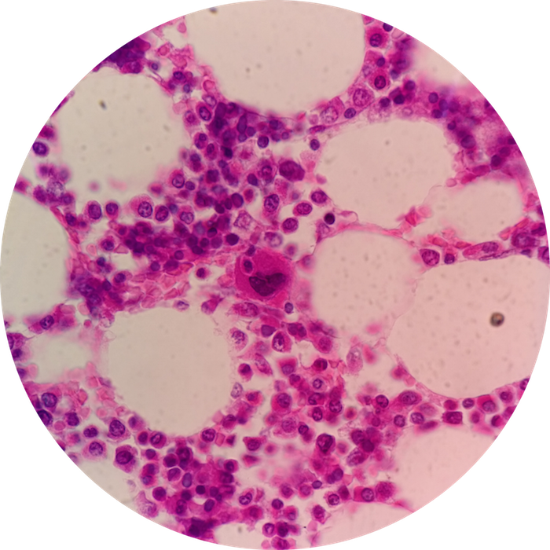
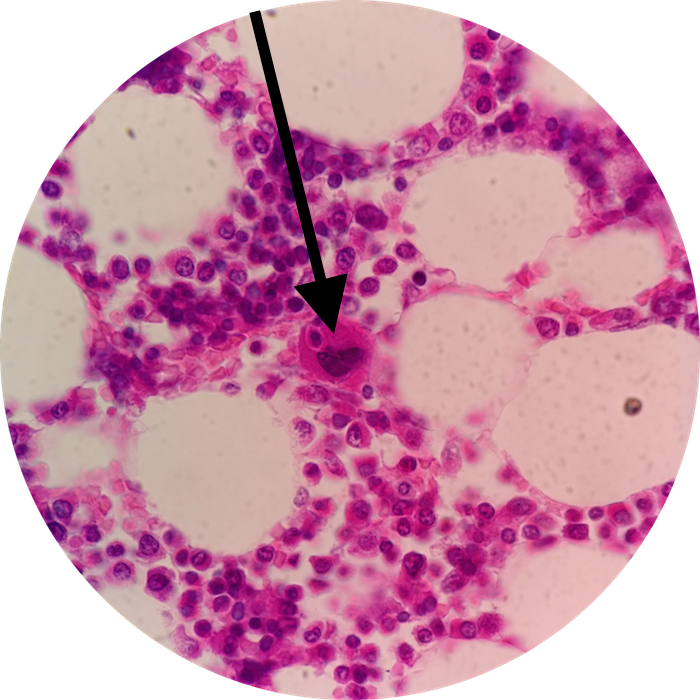

# Lab 9: Blood & Bone Marrow

 

### Lab Notebook Questions

1.	Sketch an example of the 5 main Leukocytes and give me a DETAILED function, include examples of functions given in the lab book and lecture book
2. 	Make a stepwise list of the cells involved in 
	* Granulopoiesis
	* Monopoiesis
	* Lymphopoiesesis
	* Erythropoiesis 
	* Thrombopoiesis
3.	Know Slide 28 by heart! Sketch it out in your lab notebook and understand that this is a general “stem cell”- “product” list and the above lists detail the specific steps!
4.	Make a table of all the relevant proteins in blood page 252 table 10-1 in your lecture book
5.	Include descriptions of the clinical correlations from lecture book here, summarized in YOUR OWN WORDS!

### Practice Questions

  

    <strong>Question 1</strong>
  

  

    
What type of cell is depicted at the pointer? Where in the body can this be found?

    
    

    <a class="btn btn-primary" role="button" data-toggle="collapse" href="#collapseExample01" aria-expanded="false" aria-controls="collapseExample"> Show Answer</a>
    

       
        

          Megakaryocyte of Bone Marrow
        

    

  
  

 

  

    <strong>Question 2</strong>
  

  

    
What are the cytoplasmic sheddings of Question 1 known as?

    

    <a class="btn btn-primary" role="button" data-toggle="collapse" href="#collapseExample02" aria-expanded="false" aria-controls="collapseExample"> Show Answer</a>
    

       
        

          Thrombocytes (aka "Platelets")
        

    

  
  

 

