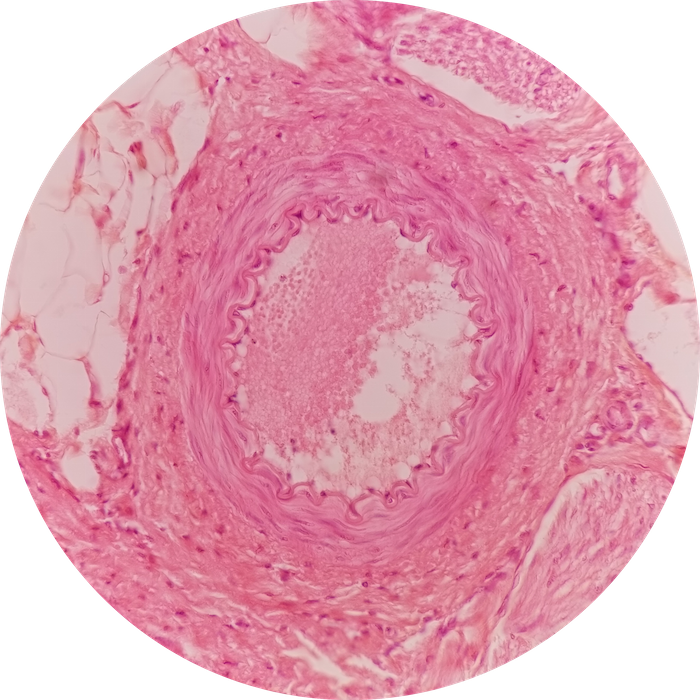
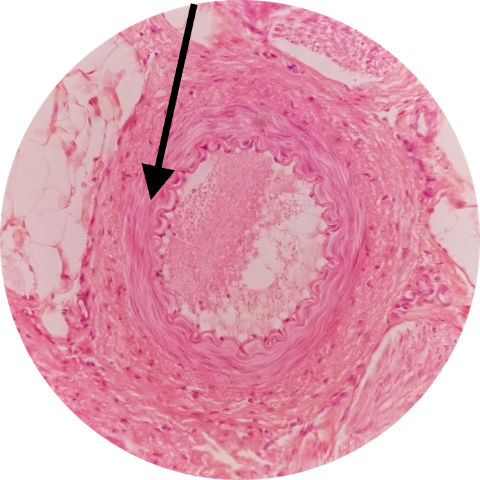

# Lab 10: Cardiovascular System

 

### Lab Notebook Questions

1.  Sketch an ENTIRE heart (on one page) and label all the major layers, cells, and include the intrinsic nodal system, and where it would be located
2.  Summarize the ‘pressure’ sensing structures of the heart, WHERE they are located, and any cells involved
3.  Make a sketch of all the different types of blood vessels, and their specific tissue make-up
4.  Make a sketch of all the different types capillaries 

### Practice Questions

  

    <strong>Question 1</strong>
  

  

    
What type of blood vessel is depicted at the pointer?

    
    

    <a class="btn btn-primary" role="button" data-toggle="collapse" href="#collapseExample01" aria-expanded="false" aria-controls="collapseExample"> Show Answer</a>
    

       
        

          Muscular Artery
        

    

  
  

 

  

    <strong>Question 2</strong>
  

  

    
What is the specific layer of Question 1?

    

    <a class="btn btn-primary" role="button" data-toggle="collapse" href="#collapseExample02" aria-expanded="false" aria-controls="collapseExample"> Show Answer</a>
    

       
        

          Tunica Media
        

    

  
  

 

