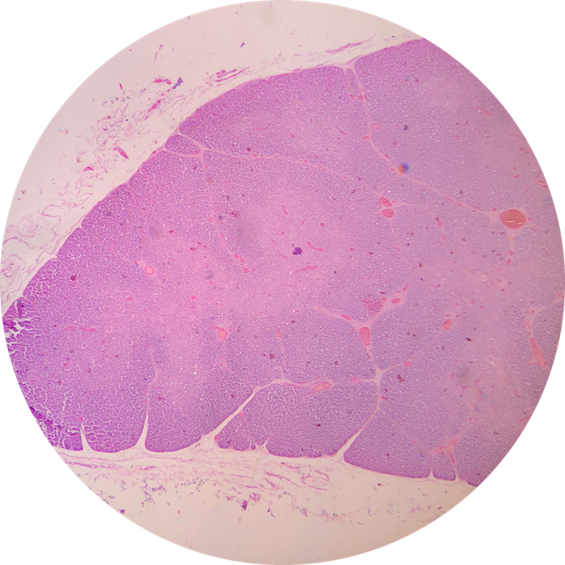
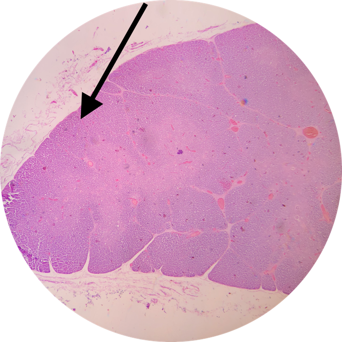

# Lab 11: Lymphatic System

 

### Lab Notebook Questions

1.  Sketch and label all the major structures and locations of cells of the lymph node
2.	Sketch and label all the major structures and locations of cells of the Spleen
3.	Sketch and label all the major structures and locations of cells of the Thymus
4.	Sketch and label all the major structures and locations of cells of the Tonsils (all 3 types) 

### Practice Questions

  

    <strong>Question 1</strong>
  

  

    
What organ is depicted in this view? What portion of this organ is depicted at the pointer?

    
    

    <a class="btn btn-primary" role="button" data-toggle="collapse" href="#collapseExample01" aria-expanded="false" aria-controls="collapseExample">Show Answer</a>
    

       
        

          Medulla of the Thymus
        

    

  
  

 

  

    <strong>Question 2</strong>
  

  

    
What is the term for the organ in Question 1 when it begins to degenerate and is replaced by adipose tissue?  When does this occur?

    

    <a class="btn btn-primary" role="button" data-toggle="collapse" href="#collapseExample02" aria-expanded="false" aria-controls="collapseExample"> Show Answer</a>
    

       
        

          Involution after Puberty
        

    

  
  

 

