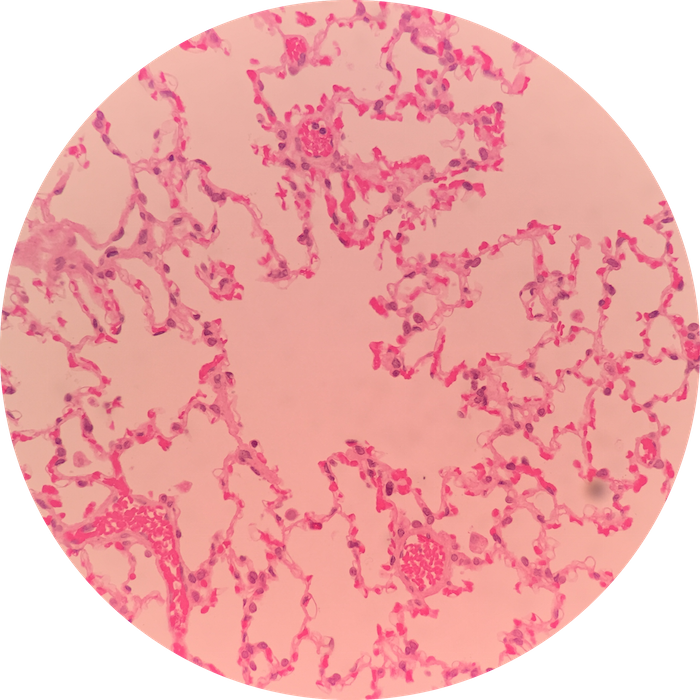

# Lab 12: Respiratory System

 

### Lab Notebook Questions

1.  Make a sketch of the Nasal Cavity, and list ALL the structures, and specific tissue types located
2.	Make a sketch of the larynx, like page 203 figure 15-5
3.	Sketch the Trachea in a longitudinal section AND cross section, and label all the cells, and specific tissue investments 
4.	Make a quick sketch of the Epiglottis and include tissue and cell types
5.	Sketch a bronchial tree like the picture below and include all the specific tissue investments and cells! (DON’T name clara cells, they are now called club cells)
	
    

6.	Sketch the histology of the lungs like on figures 15-13, and 15-14 (include all cells)
7.	For all cells; include functions! 

### Practice Questions

  

    <strong>Question 1</strong>
  

  

    
What organ is this?

    
    

    <a class="btn btn-primary" role="button" data-toggle="collapse" href="#collapseExample01" aria-expanded="false" aria-controls="collapseExample"> Show Answer</a>
    

       
        

          Lung
        

    

  
  

 

  

    <strong>Question 2</strong>
  

  

    
What type of cell is at the pointer?

    
    

    <a class="btn btn-primary" role="button" data-toggle="collapse" href="#collapseExample02" aria-expanded="false" aria-controls="collapseExample"> Show Answer</a>
    

       
        

          Alveolar Macrophage (aka "Dust Cell")
        

    

  
  

 