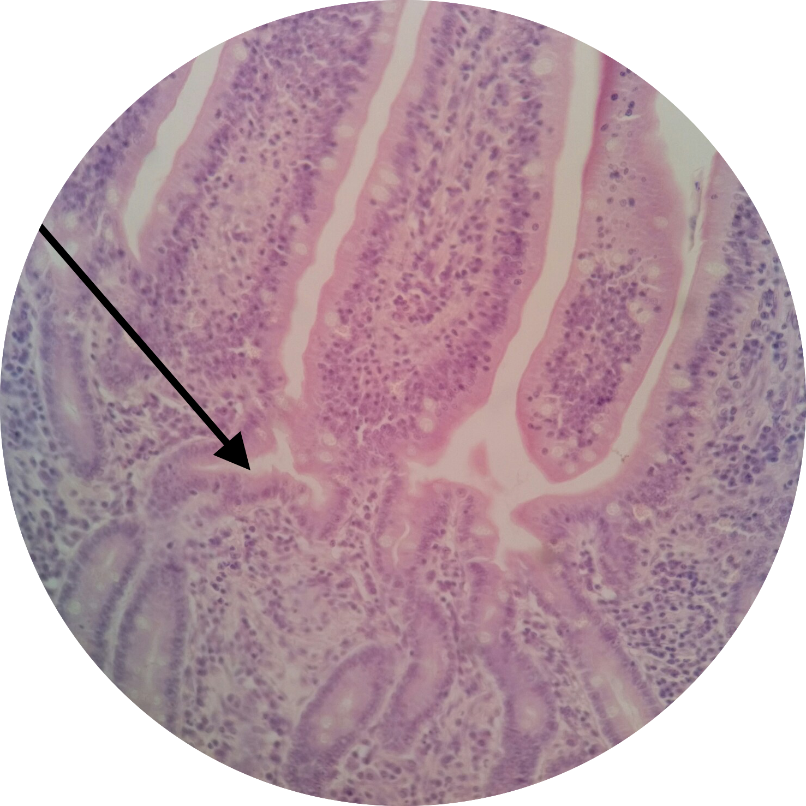

# Lab 13: Digestive System

 

### Lab Notebook Questions

1.  Oral Cavity (Indicate Epithelial differences) 
	*	Sketch the three salivary glands and indicate what ‘kind’ of acini are present, types of ducts, and specify the types of secretory products. 
	*	In the teeth, what are TWO types of cells that secrete the structural components of the teeth? 
	*	What are the functions of cementum and the periodontal ligament respectively
	*   Sketch a diagram of the tooth histologically.
2.	Which layer of the tongue is the most prominent? Why? 
	*	What is the type of type of epithelium that is responsible for “sensing” chemicals in the tongue? 
	*	What are the 3 types of papillae? 
		*	Sketch a rough shape of the different types (3 main ones, not the foliate those are present mostly in children) 
		*	Sketch an upclose view of a tastebud and label 
			*	Gustatory cell (taste)
			*	Basal cell
			*	Sustentacular cell
		*	Include functions of all 3 
3.	Sketch a detailed description of the layers see page 14-22
	*	NOTE the presence of neural tissue and where it is located, what are these specific structures called? 
4.	How does the esophagus transport a bolus? 
	*	What is the function of the esophageal gland? (aka esophageal-cardiac glands) 
	*	What part of the esophagus are these glands in? 
	*	Describe the musculature of the esophagus. 
5.	Gastroesophageal Junction (sketch) 
6.	Stomach
	*	Sketch a gastric pit and the cells that make up the gastric pit and what the 
	*	List the resident cells and structures of the lamina propria and what they produce/ secrete 
	*	The different anatomical regions of the stomach have distinct gastric pit morphology… 
	*	Pyloric Sphincter (is it a ‘sphincter’ why or why not?) 
7.	Small intestine Sketch what each segment will look like histologically (pay close attention to the residents of the submucosa. 
8.	Sketch the large intestine. Rectum, colon, and a region with the teniae coli
9.	Sketch the liver with all the different types of cells, and list their function.
10. List cells of the digestive system, what they secrete, and where they are located 
11. Make a list of the 'kinds' of epithelium located throughout the digestive system.

### Practice Questions

  

    <strong>Question 1</strong>
  

  

    
What organ is this? What specific portion?

    
    

    <a class="btn btn-primary" role="button" data-toggle="collapse" href="#collapseExample01" aria-expanded="false" aria-controls="collapseExample"> Show Answer</a>
    

       
        

          Jejunum of the Small Intestine
        

    

  
  

 

  

    <strong>Question 2</strong>
  

  

    
In this higher magnification view of Question 1, what structure is the pointer at?

    
    

    <a class="btn btn-primary" role="button" data-toggle="collapse" href="#collapseExample02" aria-expanded="false" aria-controls="collapseExample"> Show Answer</a>
    

       
        

          Intestinal Crypt of Lieberk&#252;hn (aka "Intestinal Gland")
        

    

  
  

 