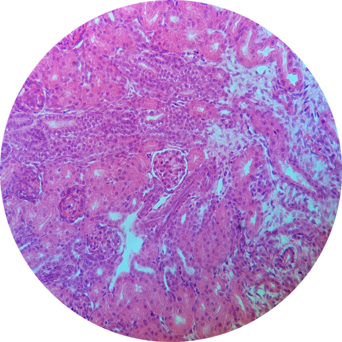
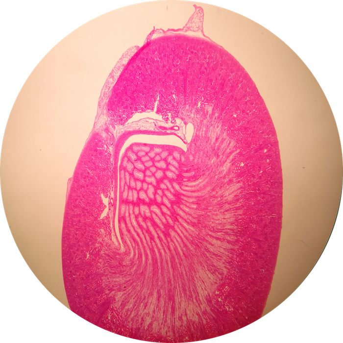
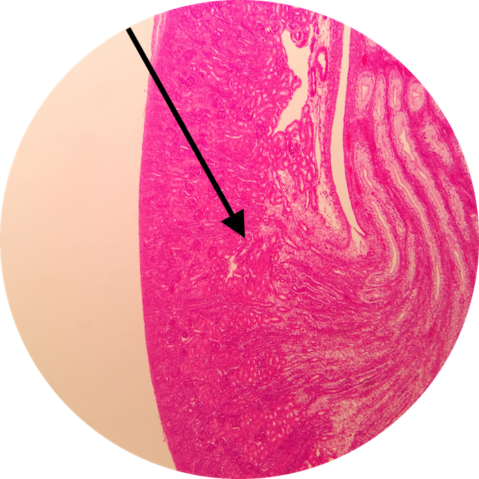
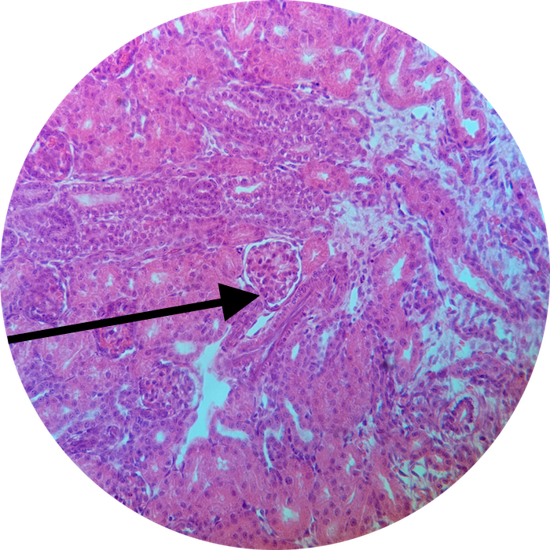

# Lab 14: Urinary System

### Lab Notebook Questions

<!-- /////////////////////////////////////////// -->
<!-- [conditional logic for release of labnotes] -->

1.  Sketch the flow of blood from the Renal artery all the way to the capillary bed
2.  Go to slide 6 of the Lab Powerpoint and label ALL structures that can bee seen histologically, and identify all the epithelial tissues, connective tissues and indicate where they are located
3.  List ALL the cells of the Juxtaglomerular Complex, and indicate what their function is (include a sketch!)
4.  Sketch a nephron – include the SPECIFIC types of ET throughout the entire NEPHRON & the LOOPS
5.  Indicate what occurs at each segment of the loops of a nephron (what gets resorbed, or excreted etc…)
6.  What is countercurrent exchange?
7.  How is urine Formed? (Look at slide 23-26 and summarize) I will ask you this on the final exam
8.  Draw a detailed glomerulus indicating where all the cells are, and the different poles
9.  Draw a urinary bladder with all of its structures, and also include the external and internal urinary sphincters
10. What is a duct of bellini?
11. What are the different types of epithelium of the male urethra?
12. Sketch a cross-ection of a ureter, and indicate all of its layers.
13. List all pathologies from textbook

  <em>Available starting: 
    
_IF_SHOWING_ERROR_DATE_NOT_SET_CORRECTLY_VIA_JS_TO_HTML

  </em>

<!-- /////////////////////////////////////////// -->

### Practice Questions

  

    <strong>Question 1</strong>
  

  

    
What organ is this?

    
    

    <a class="btn btn-primary" role="button" data-toggle="collapse" href="#collapseExample01" aria-expanded="false" aria-controls="collapseExample"> Show Answer</a>
    

       
        

          Kidney
        

    

  
  

 

  

    <strong>Question 2</strong>
  

  

    
In this higher magnification view of Question 1, what structure is at the pointer?

    
    

    <a class="btn btn-primary" role="button" data-toggle="collapse" href="#collapseExample02" aria-expanded="false" aria-controls="collapseExample"> Show Answer</a>
    

       
        

          Glomerulus
        

    

  
  

 

  

    <strong>Question 3</strong>
  

  

    
In this higher magnification view of Question 2, what is the specific location at the pointer?

    
    

    <a class="btn btn-primary" role="button" data-toggle="collapse" href="#collapseExample03" aria-expanded="false" aria-controls="collapseExample"> Show Answer</a>
    

       
        

          Vascular Pole 
        

    

  
  

  