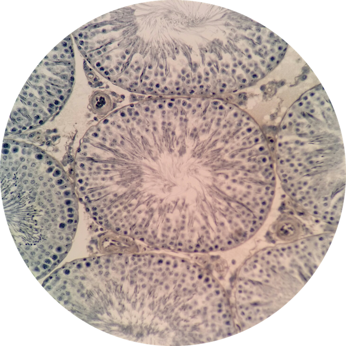
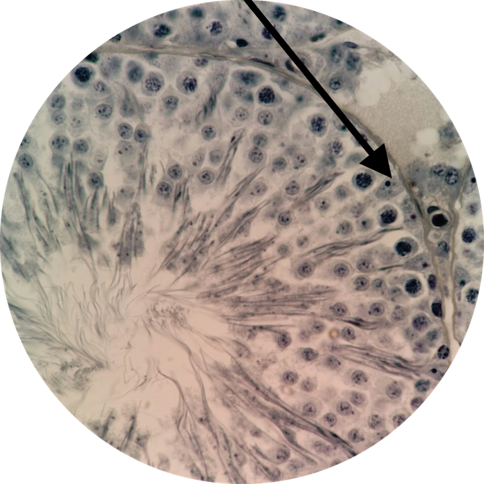

# Lab 15: Male Reproductive System

### Lab Notebook Questions

1.  List all the male pathologies 
2.	Make a list of the male hormones (like in the lab book – page 224; powerpoint slide 15, 16)
3.	List all the glands of the male reproductive system, and what they secrete
4.	Go to slide 11, 18 and sketch the inside of a seminiferous tubule, all the cells, and indicate if the cell is diploid or haploid AND its function
5.	Indicate and draw the different parts of a spermatozoon, and a brief description of each segment (slide 13,14)
6.	Describe the physiological effects of Leydig cells (slide 22)
7.	Sketch and provide a description for 
	*	The epididymis
	*	The prostate gland
	*	Vas deferens (ductus deferens)
	*	Seminal Vesicle
	*	Ejaculatory Duct

### Practice Questions

  

    <strong>Question 1</strong>
  

  

    
What organ is this?

    
    

    <a class="btn btn-primary" role="button" data-toggle="collapse" href="#collapseExample01" aria-expanded="false" aria-controls="collapseExample"> Show Answer</a>
    

       
        

          Testes
        

    

  
  

 

  

    <strong>Question 2</strong>
  

  

    
In this higher magnification view of Question 1, what type of cell is at the pointer?

    
    

    <a class="btn btn-primary" role="button" data-toggle="collapse" href="#collapseExample02" aria-expanded="false" aria-controls="collapseExample"> Show Answer</a>
    

       
        

          Sertoli cell (aka "Nurse cell")
        

    

  
  

 