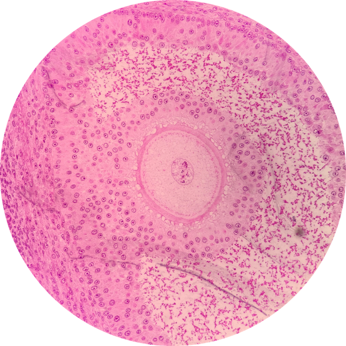

# Lab 16: Female Reproductive System

_TODO_someContent

 
 
 
 
 
 
 

### Lab Notebook Questions

1.  Sketch This
2.  Sketch That

### Practice Questions

  

    <strong>Question 1</strong>
  

  

    
What is the entire structure depicted? What specific portion of this structure is the pointer at?

    
    

    <a class="btn btn-primary" role="button" data-toggle="collapse" href="#collapseExample01" aria-expanded="false" aria-controls="collapseExample"> Show Answer</a>
    

       
        

          Antrum of the Graafian Follicle
        

    

  
  

 

  

    <strong>Question 2</strong>
  

  

    
In what organ do you find the structure from Question 1?

    

    <a class="btn btn-primary" role="button" data-toggle="collapse" href="#collapseExample02" aria-expanded="false" aria-controls="collapseExample"> Show Answer</a>
    

       
        

          Ovary
        

    

  
  

 