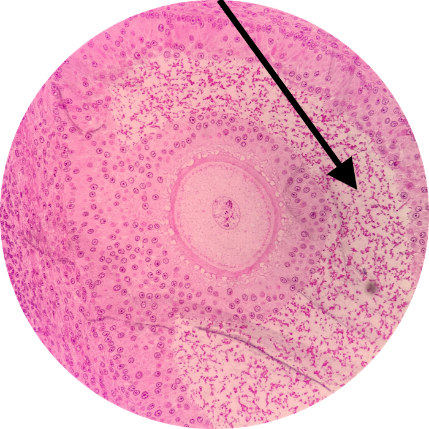

# Lab 16: Female Reproductive System

### Lab Notebook Questions

1.  List all of the pathologies of the female reproductive system from your text book
2.	Draw a general layout of the female reproductive system (and label all anatomical structures like on slide 40,57 of the powerpoint)
3.	List the hormones of the Female reproductive system (page 226 lab book)
4.	Draw the different stages of follicular development (Slide 42, general) and include details 
5.	What is (include sketch of) corpus hemmorhagicum, corpus luteum, corpus albicans, 
6.	Sketch the Fallopian tube, and label its different segments, and include all relevant cells, and their functions. 
7.	Sketch the different layers of the uterus
8.	Sketch and detail the menstrual cycle, and include the interplay with oovarian, follicular, and uterine cycles play a role on the menstrual cycle (I drew this on the board!!!) 
9.	Sketch what the 3 different uterine phases appear in a histological representation
10.	What is the epithelium of the various organs, and structures of the female reproductive system? 
11.	Sketch the mammary glands, and include all relevant cells, and their functions 

### Practice Questions

  

    <strong>Question 1</strong>
  

  

    
What is the entire structure depicted? What specific portion of this structure is the pointer at?

    
    

    <a class="btn btn-primary" role="button" data-toggle="collapse" href="#collapseExample01" aria-expanded="false" aria-controls="collapseExample"> Show Answer</a>
    

       
        

          Antrum of the Graafian Follicle
        

    

  
  

 

  

    <strong>Question 2</strong>
  

  

    
In what organ do you find the structure from Question 1?

    

    <a class="btn btn-primary" role="button" data-toggle="collapse" href="#collapseExample02" aria-expanded="false" aria-controls="collapseExample"> Show Answer</a>
    

       
        

          Ovary
        

    

  
  

 