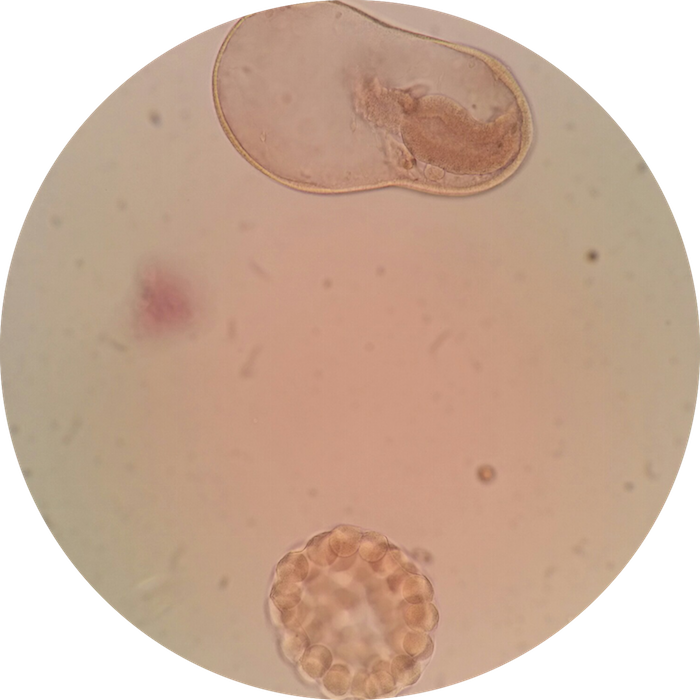
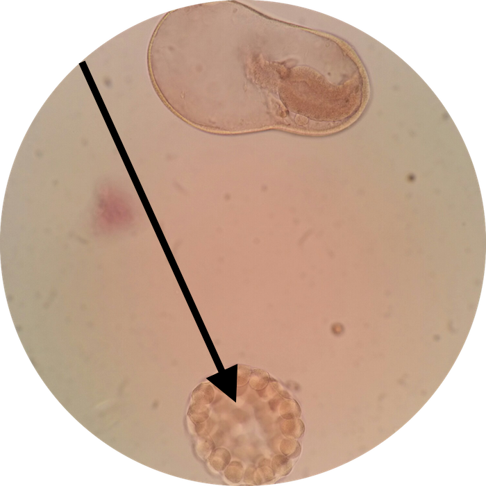

# Lab 17: Embryology

<!--  

### Lab Notebook Questions

1.  Sketch This
2.  Sketch That -->

### Practice Questions

  

    <strong>Question 1</strong>
  

  

    
What is embryonic structure at the pointer?

    
    

    <a class="btn btn-primary" role="button" data-toggle="collapse" href="#collapseExample01" aria-expanded="false" aria-controls="collapseExample"> Show Answer</a>
    

       
        

          Morula
        

    

  
  

 

  

    <strong>Question 2</strong>
  

  

    
What embryonic structure is the precursor to Question 1?

    

    <a class="btn btn-primary" role="button" data-toggle="collapse" href="#collapseExample02" aria-expanded="false" aria-controls="collapseExample"> Show Answer</a>
    

       
        

          Zygote
        

    

  
  

 

  

    <strong>Question 3</strong>
  

  

    
What embryonic structure does Question 1 give rise to?

    

    <a class="btn btn-primary" role="button" data-toggle="collapse" href="#collapseExample03" aria-expanded="false" aria-controls="collapseExample"> Show Answer</a>
    

       
        

          Blastocyst
        

    

  
  

