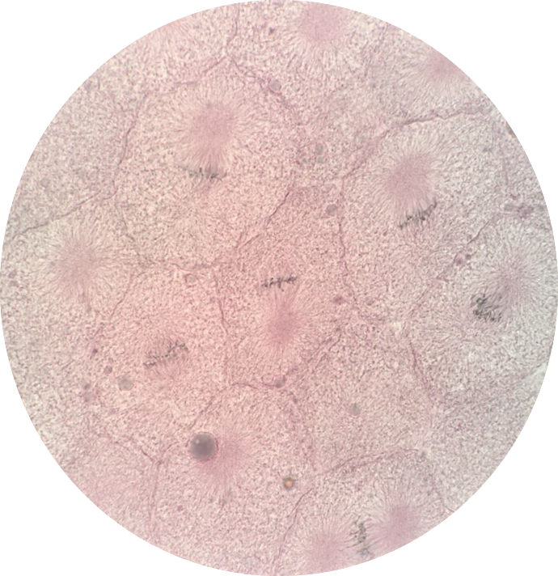
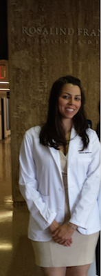

# Announcements

* Welcome Fall 2018 Students! 
* There will be lab during the first week of the semester. 
* Lecture will be held in WHI197
* Lab will be held in WHI202.

 
 

# Course Schedule (Fall Term 2018)

| Date                                 | Lecture Topic                        | Laboratory Topic                                       |
|:-------------------------------------|:-------------------------------------|:-------------------------------------------------------|
| August 27/28   (Monday/Tuesday)   | Histological Technique,  The Cell | Histological Technique,  The Cell, & Epithelium     |
| August 29/30   (Wednesday/Thursday) | Epithelium                          | Connective Tissue                                          |
| September 3/4   (Monday/Tuesday)     | **No Class   (Labor Day)**                          | **No Class   (Labor Day)**                                       |
| September 5/6   (Wednesday/Thursday) | Epithelium                          | Skeletal System                                          |
| September 10/11   (Monday/Tuesday)     | Connective Tissue                          | **Pathology 1 / Quiz 1**                                          |
| September 12/13   (Wednesday/Thursday) | Bone & Cartilage                          | Muscular System                                          |
| September 17/18   (Monday/Tuesday)     | Integumentary System                          | Integumentary System                                          |
| September 19/20   (Wednesday/Thursday) | Muscle Tissue                          | Neurology                                          |
| September 24/25   (Monday/Tuesday)     | Nervous System                          | **Pathology 2 / Quiz 2**                                           |
| September 26/27   (Wednesday/Thursday) | Special Senses                          | Special Senses                                          |
| October 1/2   (Monday/Tuesday)     | Review   (Powerpoints will NOT be posted)                          | Diagnostic Pathology Lab                                          |
| October 3/4   (Wednesday/Thursday) | **EXAM 1**                          | Review                                           |
| October 8/9   (Monday/Tuesday)     | Endocrine System                          | **PRACTICAL 1**                                          |
| October 10/11   (Wednesday/Thursday) | Endocrine System                          | Endocrinology                                          |
| October 15/16   (Monday/Tuesday)     | Blood and Hematopoiesis                          | Hematology                                          |
| October 17/18   (Wednesday/Thursday) | Circulatory System                          | Cardiology                                          |
| October 22/23   (Monday/Tuesday)     | Lymphatic System                          | **Pathology 3 / Quiz 3**                                           |
| October 24/25   (Wednesday/Thursday) | Respiratory System                          | Lymphatic System                                          |
| October 29/30   (Monday/Tuesday)     | Digestive System                          | Pulmonology                                          |
| Oct. 31/ Nov. 1   (Wednesday/Thursday) | Urinary System                            | Gastroenterology                                          |
| November 5/6   (Monday/Tuesday)     | Review   (Powerpoints will NOT be posted)                         | Nephrology/Urology                                          |
| November 7/8   (Wednesday/Thursday) | **EXAM 2**   (CH.19 NOT included)                         | **Pathology 4 / Quiz 4**                                            |
| November 12/13   (Monday/Tuesday)     |  **No Class   (Veterans Day)**                          | **No Class   (Veterans Day)**                                       |
| November 14/15   (Wednesday/Thursday) | Male Reproductive System                          | Diagnostic Pathology Lab                                          |
| November 19/20   (Wednesday/Thursday) | Female Reproductive System                         | **PRACTICAL 2**                                            |
| November 21/22   (Monday/Tuesday)     | Embryology / Development                          | **No Class   (Thanksgiving Recess)**                                              |
| November 26/27   (Wednesday/Thursday) | Student Presentations                          | Male Reproductive System                                          |
| November 28/29   (Monday/Tuesday)     | Student Presentations                          | Female Reproductive System                                          |
| December 3/4   (Monday/Tuesday)     | Student Presentations                          | Embryology                                          |
| December 5/6   (Wednesday/Thursday) | Student Presentations                          | **Pathology 5 / Quiz 5**                                            |
| December 12   (Wednesday) | **FINAL EXAM**   (10:10am-12:20pm)                  | **FINAL PRACTICAL**   (TBD)                                       |

 

# Credits and Contributions 

#### Course Professor

* Dr. Robert Winokur

#### Lab Instructors

* Victor Barragan             
<!-- * Alex Deehl                  -->
* Oscar Monterrosa

#### Undegraduate Teaching Assistants

* Natalie Contreras 
* Matthew Khumnrak 
* Jennifer Phan
* Richard Van

#### Course Contributor

* Daniella Sandoval, Chicago Medical School

<!--  -->

#### Webmaster
* [Richard Van](mailto:vanr1@unlv.nevada.edu)

 

