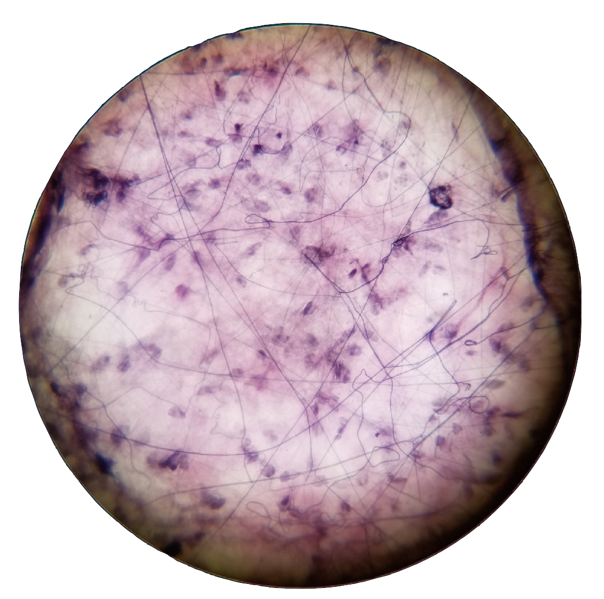

#### Hello Victor





# Course Schedule (Summer Term 2018)

| Date                    | Lecture Topic                        | Laboratory Topic                                       |
|:------------------------|:-------------------------------------|:-------------------------------------------------------|
| MONDAY June 4           | Histological Technique, The Cell     | Histological Technique, The Cell & Epithelium          |
| TUESDAY June 5          | Epithelium                           | Connective Tissues                                     |
| WEDNESDAY June 6        | Connective tissues                   | **Quiz I**                                             |
| THURSDAY June 7         | Bone & Cartilage                     | Skeletal System, Pathology Discussion 1                |
| FRIDAY   June 8         | Integumentary System                 | Muscular System                                        |
| MONDAY June 11          | Muscle Tissue                        | Integumentary System                                   |
| TUESDAY June 12         | Nervous System & Special Senses      | Nervous System                                         |
| WEDNESDAY June 13       | **EXAM I**                           | **Quiz II**                                            |
| THURSDAY June 14        | Endocrine System                     | Special Senses, Pathology Discussion 2                 |
| FRIDAY June 15          | Blood & Hematopoiesis                | Endocrinology                                          |
| MONDAY June 18          | Circulatory System                   | Practical I (_Lab Reports Due_)                        |
| TUESDAY June 19         | Lymphatic System                     | Blood & Hematopoiesis                                  |
| WEDNESDAY June 20       | Respiratory System                   | **Quiz III**                                           |
| THURSDAY June 21        | Digestive System                     | Cardiovascular System, Pathology Discussion 3          |
| FRIDAY June 22          | Digestive System                     | Lymphatic System                                       |
| MONDAY June 25          | **EXAM II**                          | Respiratory System, **Quiz IV** Pathology Discussion 4 |
| TUESDAY June 26         | Urinary System                       | Digestive System                                       |
| WEDNESDAY June 27       | Male Reproductive System             | **Practical II**                                       |
| THURSDAY June 28        | Female Reproductive System           | Urinary System, Pathology Discussion 5                 |
| FRIDAY June 29          | Female Reproductive System           | Male Reproductive System                               |
| MONDAY July 2           | Development                          | Female Reproductive System                             |
| TUESDAY July 3          | Student Presentations                | Embryology, Pathology Discussion 6                     |
| WEDNESDAY July 4        | 4th of July Holiday                  | 4th of July Holiday                                    |
| THURSDAY July 5         | Review                               | Review                                                 |
| FRIDAY July 6           | **Final Exam (11:00 a.m.-1:10 p.m.)**| **Final Practical (TBA)**                              |


<br>
<br>
<br>
<br>
<br>
<br>
<br>
<br>
<br>
<br>
<br>


## ________TODO_LIST + __NICE_TO_HAVE_IDEAS__

*   Opening page with current schedule from syllabus (copy same formatting)
*   Slide list for each lab 
*   Lab notebook questions
*   Example Quiz/Pratical questions

 
<br>
<br>
<br>
<br>
<br>
<br>
<br>
<br>
<br>
<br>
 
# TOOLS 
#### (possible formats/styles for this website)

Text can be **bold**, _italic_, or ~~strikethrough~~.

[Link to another page](./another-page.html).

[Link to another page 2](./another-page-2.html).

There should be whitespace between paragraphs.

There should be whitespace between paragraphs. We recommend including a README, or a file with information about your project.

# Header 1

This is a normal paragraph following a header. GitHub is a code hosting platform for version control and collaboration. It lets you and others work together on projects from anywhere.

## Header 2

> This is a blockquote following a header.
>
> When something is important enough, you do it even if the odds are not in your favor.

### Header 3

```js
// Javascript code with syntax highlighting.
var fun = function lang(l) {
  dateformat.i18n = require('./lang/' + l)
  return true;
}
```

```ruby
# Ruby code with syntax highlighting
GitHubPages::Dependencies.gems.each do |gem, version|
  s.add_dependency(gem, "= #{version}")
end
```

#### Header 4

*   This is an unordered list following a header.
*   This is an unordered list following a header.
*   This is an unordered list following a header.

##### Header 5

1.  This is an ordered list following a header.
2.  This is an ordered list following a header.
3.  This is an ordered list following a header.

###### Header 6

| head1        | head two          | three |
|:-------------|:------------------|:------|
| ok           | good swedish fish | nice  |
| out of stock | good and plenty   | nice  |
| ok           | good `oreos`      | hmm   |
| ok           | good `zoute` drop | yumm  |

### There's a horizontal rule below this.

* * *

### Here is an unordered list:

*   Item foo
*   Item bar
*   Item baz
*   Item zip

### And an ordered list:

1.  Item one
1.  Item two
1.  Item three
1.  Item four

### And a nested list:

- level 1 item
  - level 2 item
  - level 2 item
    - level 3 item
    - level 3 item
- level 1 item
  - level 2 item
  - level 2 item
  - level 2 item
- level 1 item
  - level 2 item
  - level 2 item
- level 1 item

### Small image


### Large image


### Definition lists can be used with HTML syntax.

<dl>
<dt>Name</dt>
<dd>Godzilla</dd>
<dt>Born</dt>
<dd>1952</dd>
<dt>Birthplace</dt>
<dd>Japan</dd>
<dt>Color</dt>
<dd>Green</dd>
</dl>

```
Long, single-line code blocks should not wrap. They should horizontally scroll if they are too long. This line should be long enough to demonstrate this.
```

```
The final element.
```
